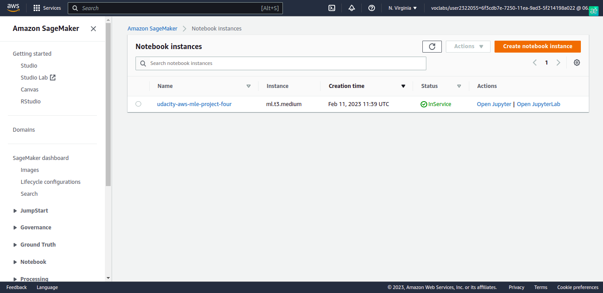
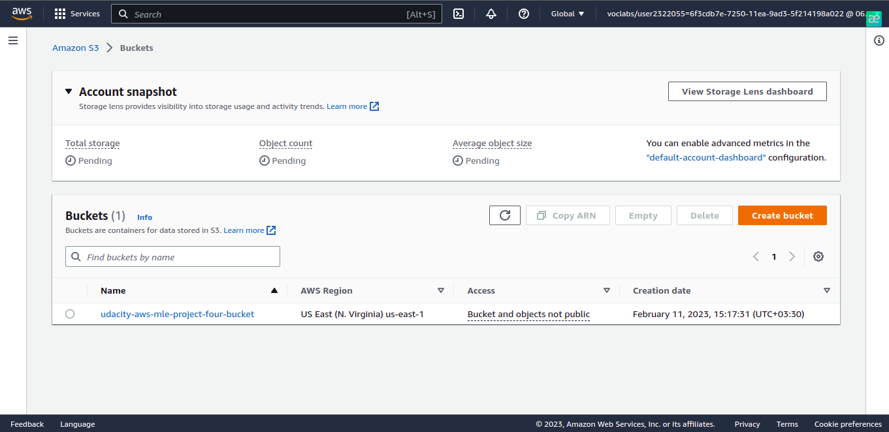
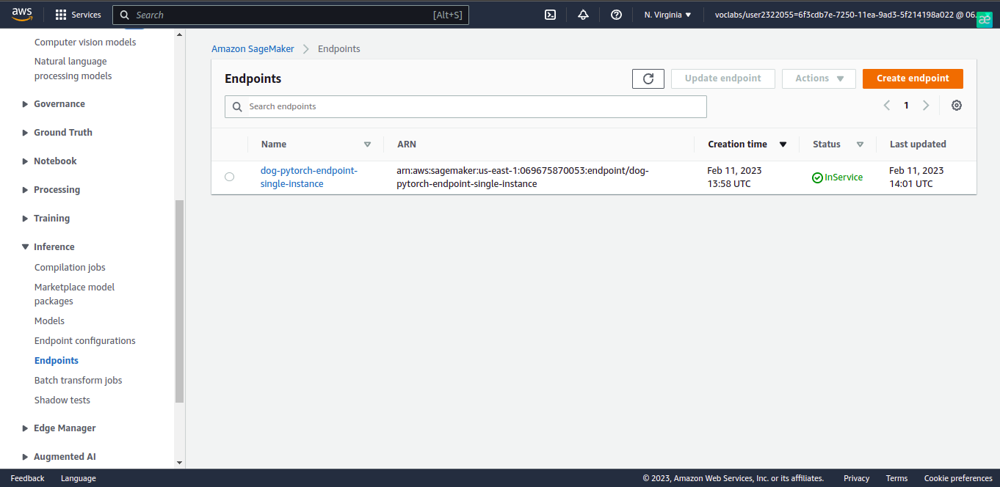
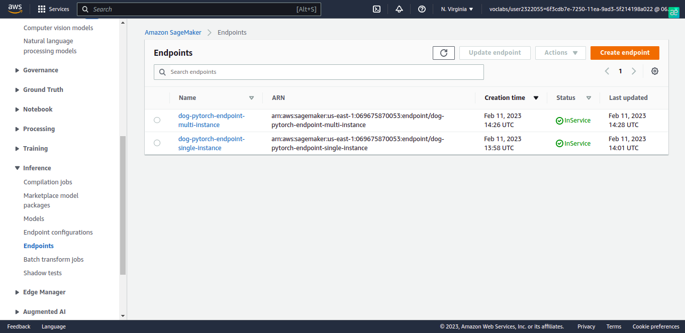
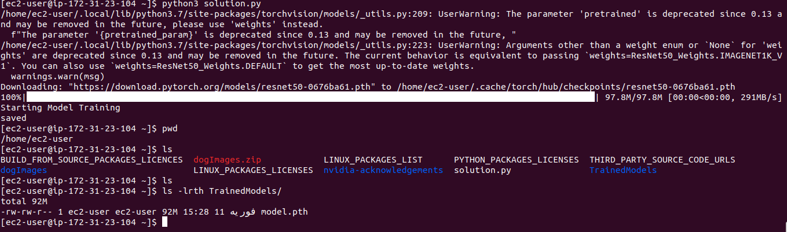
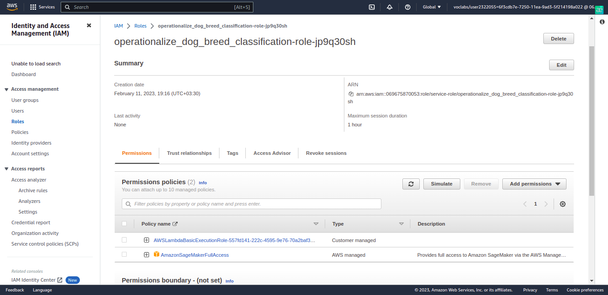

# Operationalizing an AWS ML Project

In this project, we'll start with a completed ML project. Our goal in this project will be to use several important 
tools and features of AWS to adjust, improve, configure, and prepare the model we started with for production-grade 
deployment.

Taking raw ML code and preparing it for production deployment is a common task for ML engineers, and it's very 
important for the following reasons:

1. ML code alone isn't sufficient for most business scenarios. Real business situations require ML code to integrate 
with other infrastructures, like API's, applications, or other websites that require ML code to be correctly configured.
2. If ML code is deployed in a way that's not optimal, it can lead to cost overruns or bad performance.
3. When ML code is moved to production deployment, security is always a concern, since poor security can lead to data 
leaks or performance issues. 

## Project Summary
1. Train and deploy a model on Sagemaker, using the most appropriate instances. Set up multi-instance training in our 
Sagemaker notebook.
2. Adjust our Sagemaker notebooks to perform training and deployment on EC2.
3. Set up a Lambda function for your deployed model. Set up auto-scaling for our deployed endpoint as well as 
concurrency for our Lambda function.
4. Ensure that the security on our ML pipeline is set up properly.

## Initial setup
First, we create and open a Sagemaker instance from ```Notebooks > Instances``` section of AWS SageMaker. After creating 
the instance, it's running as shown below:



Due to [this link](https://github.com/awsdocs/amazon-sagemaker-developer-guide/blob/master/doc_source/notebooks-available-instance-types.md), 
the ```ml.t3.medium``` is a suitable option to choose the notebook instance type: fast launch, 
CPU-intensive, and offering a balance of compute, memory, and network resources.
For training, I chose the ```ml.m5.xlarge``` instance type due to its acceptable time processing and resource consumption.

## Download data to an S3 bucket
The first three cells of the [train_and_deploy-solution.ipynb](./train_and_deploy-solution.ipynb) will download data to 
our AWS workspace.



## Training and Deployment
We run remaining cells in [train_and_deploy-solution.ipynb](./train_and_deploy-solution.ipynb). This finds the best 
hyperparameters for training our model, trains our base ResNet50 model in both single-instance and multi-instance 
trainings, and deploy an endpoint to ```Inference > Endpoints``` section of AWS SageMaker account.

For switching between single-instance and multi-instance training, it's just to change the value of ```instance_count``` 
parameter in ```sagemaker.pytorch.PyTorch``` class instantiation.

single-instance training endpoint


multi-instance training endpoint



## EC2 Training
The next step is to set up an EC2 instance and accomplish model training there.

We create an EC2 instance and connect to it. We have a typical task which needs a balance of time, computation and 
networking resources. As described in [here](https://aws.amazon.com/ec2/instance-types/) and 
[here](https://github.com/awsdocs/amazon-sagemaker-developer-guide/blob/master/doc_source/notebooks-available-instance-types.md), 
then we can choose a general purpose instance. Among these instances, I chose ```ml.m5.xlarge``` instance type due to 
its acceptable time processing and resource consumption and shining former experience I had when I was working with.

After we've connected to the instance, obtain the data we need for training, by running the following two commands in 
our EC2 terminal:

```
wget https://s3-us-west-1.amazonaws.com/udacity-aind/dog-project/dogImages.zip
unzip dogImages.zip
mkdir TrainedModels
nano solution.py
# TODO: Paste all of the code from the starter file called ec2train1.py into this file. After that, save and close the 
# file.
python solution.py
```

As we can see in the screenshot below, the mode is trained and saved into ```TrainedModels``` directory.



## Setting up a Lambda function
After training and deploying our model, setting up a Lambda function is an important next step. Lambda functions enable 
our model and its inferences to be accessed by API's and other programs, so it's a crucial part of production 
deployment.

We need to set up a Lambda function that uses Python 3 for its runtime.[lambdafunction.py](./lamdafunction.py) contains 
the logic of the Lambda function with an endpoint corresponds to single-instance/multi-instance training.

You can test both single-instance and multi-instance training endpoints by change the ```endpoint_name``` variable in 
[lambdafunction.py](./lamdafunction.py).


Then we'll have to find the "role" that the lambda function is using in the IAM interface, attach the correct security 
policy to the role of the lambda function. The security policy we attach should be one that allows our lambda function 
to access all of our SageMaker endpoints.



After resolving the lambda function security issue, we can test our lambda function. We can use the following text for 
our test event:

```
{ "url": "https://s3.amazonaws.com/cdn-origin-etr.akc.org/wp-content/uploads/2017/11/20113314/Carolina-Dog-standing-outdoors.jpg" }
```

We can see the result of the test event above:


## Concurrency & Auto-scaling

We should set up concurrency for our Lambda function. Concurrency will make our Lambda function better able to 
accommodate high traffic because it will enable our function to respond to multiple invocations at once. We used 
provisioned concurrency since we have a requirement receiving a lot of traffic, so we need an automatic way for 
handling that. So we set provisioned concurrency to 3.

In addition to setting up concurrency for our Lambda function, we should also set up auto-scaling for our deployed 
endpoint. Due to the strength of the instance type we chose(```ml.m5.xlarge```), we set ```maximum_instance_count``` 
to 3. We also set the target value at the configuration of auto-scaling to 25 because we think it’s a suitable 
threshold to trigger the auto-scaling mechanism. If we choose a small number, then the auto-scaling is over triggered 
even if it’s not needed. If we choose a high number, then the auto-scaling may never be called. Scale-in and scale-out 
cool down values were both set to 30 seconds due to a balance of resource management, cost management and time 
acceptability.